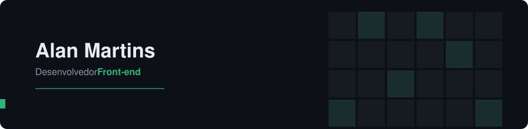

##  Sobre mim

Desenvolvedor front-end focado em performance, clareza e experiência do usuário. Gosto de transformar ideias em interfaces rápidas e bem construídas, sempre buscando evoluir a cada projeto.

Também atuo com ajustes no back-end em aplicações C# e .NET, o que amplia minha visão sobre o funcionamento completo das aplicações.

 

##  Stack principal

**Front-end**

**Linguagens**

**Back-end & Dados**

 

##  Estatísticas

   

 

##  Contato

